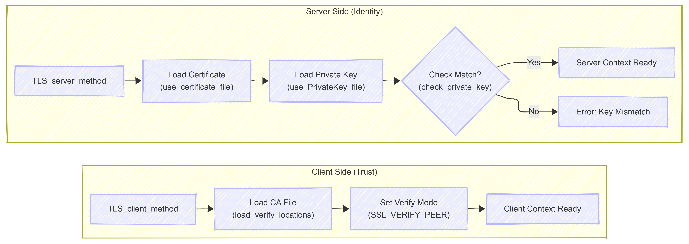
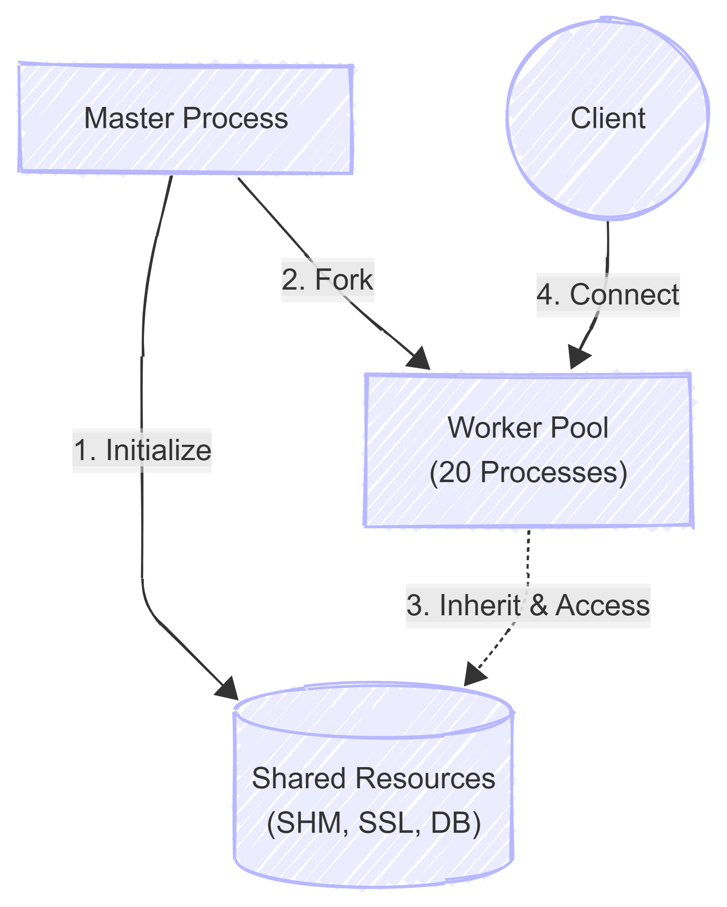
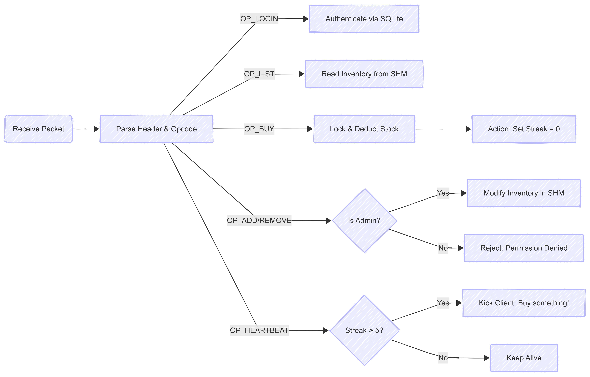

# Online Shopping Sysyem (final project)
High-Concurrency Client-Server Network Service System.

## Task Assignment


## Overall Architecture


## Certificate Diagram


## Master-Worker Pattern

#### Master


#### Worker


## Build & Run

### Build
Compile the project:
```bash
make
```

### Run Server
```bash
make run-server
```

### Run Client
```bash
make run-client
```

### Run Stress Test
```bash
make run-stress
```